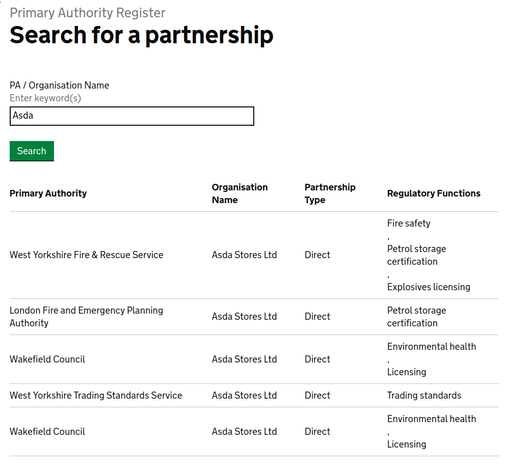

# Data for a register of primary authorities

> [Primary Authority](https://www.gov.uk/guidance/local-regulation-primary-authority) enables businesses to form a legal partnership with one local authority, which then provides assured and tailored advice on complying with environmental health, trading standards or fire safety regulations that other local regulators must respect.

## Data model

There are two parties involved: a 'primary authority', e.g. a local authority
or some other government agency, and a 'business'.

The key would be meaningless: there's no key in the BEIS register, and none of
the other fields is unique.

The primary authority might exist in a register already, or might not, so the
register would need both a `name` field (if they don't exist in another register
yet) and an `organisation` field (CURIE to another register).  This is like the
[government-domain register](https://government-domain.register.gov.uk/).

The 'business' will often be a registered company (e.g. 'Asda'), but sometimes
not (e.g. 'British Army'), so the register would need two fields for that, too.

There might be a couple of related registers to normalise the `Partnership Type`
and `Regulatory Functions` fields.  The regulatory functions could then be
represented by a `cardinality = 'n'` field.

## Data gotchas

The screenshot shows some examples of things that could be cleaned up.

* The two 'Wakefield Council' records appear to be duplicates.
* The London Fire and Emergency Planning Authority doesn't have its own record
    in another register, but it is under the `london-fire.gov.uk` domain.  How
    should we refer to it?
* The field 'Organisation name' might make it difficult to use the
  `organisation` field that is already defined in registers.

## Licence

Unless stated otherwise, the codebase is released under [the MIT licence](./LICENSE).

The data is [© Crown
copyright](http://www.nationalarchives.gov.uk/information-management/re-using-public-sector-information/copyright-and-re-use/crown-copyright/)
and available under the terms of the [Open Government
3.0](https://www.nationalarchives.gov.uk/doc/open-government-licence/version/3/)
licence.
